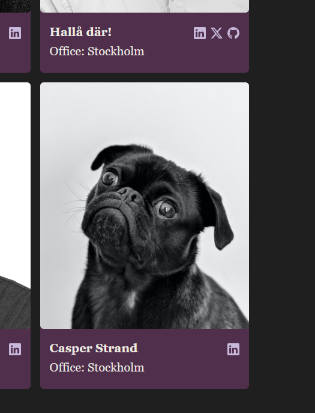

# Frontend Codetest

I had to submit both Backend and Frontend due to my base as Fullstack, and got informed that I didn't have to fully complete the frontend portion - I simply did enough to illustrate that I have the skills.  

## Instructions

Your assignment is to create a site to display all of our colleagues. We have a
whole bunch of user stories but in this first iteration we want you to handle a minimum of 5, and no more than 7 of the available user stories found below. We want you to finish the ones you chose as well as possible, rather than maximizing your feature count.

We want at least 1 story to be implemented from each of the requirement areas in the matrix further below in this document, and the rest is up to you! Make sure the end product still creates a somewhat user-friendly page though. Also, keep in mind that this is a chance for you to display what you know and how you want to design your code.

You can either do a vanilla solution or use a **framework**, in either case, we expect a thorough structure. Design it as if you were to hand it over to another developer for future development. Everything needed to run the application must be found within the repository, i.e. we do not expect to have to install for example a database manager if you have decided to use one. Docker, however, is acceptable.

### Requirements

- Typescript ✅
- Modern CSS, css-grids, min(), max(), clamp(), variables etc. ✅
    - Also used CSS with SASS-like encapsulation which is now supported ✅
    - I would still use SASS for the function support and easier/more powerful with variables in a production setting

### Wireframe layout

- Page Title ✅
- Filter/tool area full width ❌
- Grid 4 frames wide with cards ✅
- cards separated with a top/bottom section ✅
- card top contains avatar pic ✅
- card bottom contains name, office and social icons ✅

## Notes and documentation

- Nothing groundbreaking going on here, given that I was instructed to put most of my effort on the backend codetest. This is merely to illustrate that I have proficiency with frontend as well.
- Didn't really focus on checking off the features and functional requirements, just tried to set up a pretty basic showcase. However, below are some notes on the main ones whether or not I implemented them.
    - Color blindness (Lighthouse or Figma can be used to check for these, I just picked a palette that seemed to have good separation on the grayscale)
    - The grid, although basic, is responsive
    - Screen reader functionality can be checked and implemented with the help of WCAG 2.0 tools, although with good basics most of the time you don't have to deal with it directly (like ensuring your headers are used propertly with waterfall flow h1-h6)
    - Didn't get around to any functionality, but these seem trivial.
        - Sorting could be done by sorting the list after specific parameters using the variables within
        - Filter would change the output selection to the result from the filter
        - Various views could employ new components for each viewtype and a selector between them
        - Hosting and CI/CD are beyond the scope for this but something I'm comfortable doing
    - Testing/QA was also beyond the scope but something I'm comfortable doing (like using Jest for this and even combine it in CI to ensure nothing else fails with new pushes).
- In the best of worlds, you'd be able to have pagination through the API instead of getting it all at once 😄

## Instructions

Set up .env with proper values, duplicate from .example.env

Install: `npm install`

Run it: `npm start` and head on to [http://localhost:3000](http://localhost:3000) in your favorite browser.

Press "Load colleagues" button to load in everything

## Result

